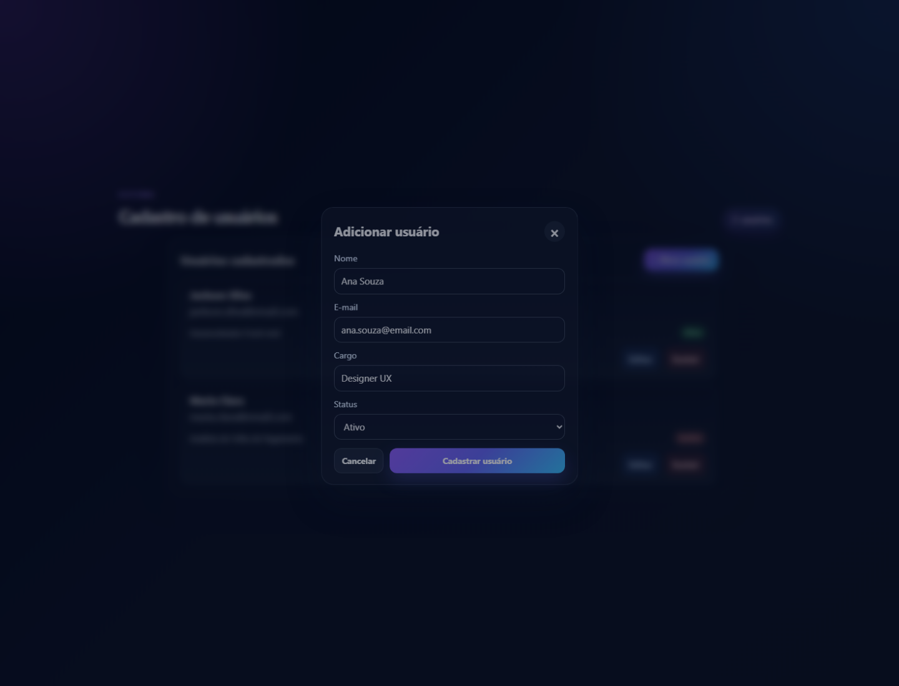
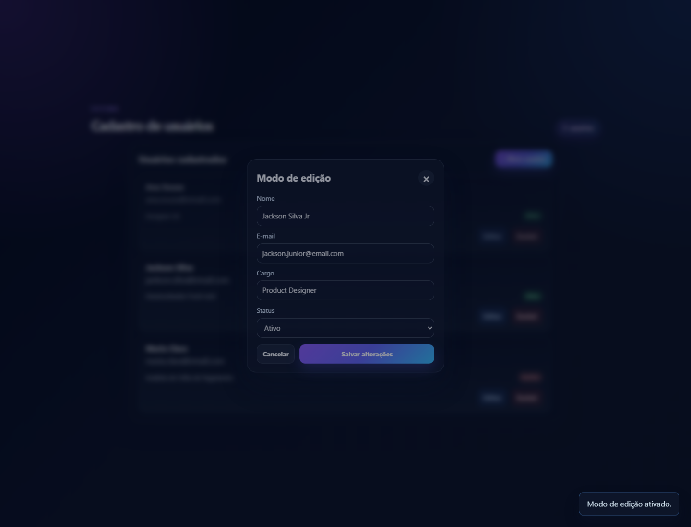

# CRUD de Usuários React

Sistema de cadastro de usuários com interface moderna, layout compacto e fluxo completo de CRUD.

## Preview do sistema

### Tela inicial


### Adicionar usuário



### Editar usuário



### Excluir usuário


## Funcionalidades

- Cadastro de novos usuários
- Edição em modal centralizado
- Exclusão com confirmação
- Contador de usuários com regra de singular e plural
- Layout responsivo e visual em tons escuros com destaque em roxo/ciano
- Animações suaves e feedback visual para ações

## Tecnologias

- React
- Vite
- JavaScript
- CSS moderno

## Como executar localmente

1. Clone o repositório
2. Instale as dependências:

```bash
npm install
```

3. Inicie o projeto:

```bash
npm run dev
```

4. Acesse a aplicação no navegador:

```bash
http://localhost:5173
```

## Build para produção

```bash
npm run build
```

## Estrutura do projeto

```bash
src/
  App.jsx
  App.css
  index.css
  main.jsx
```

Este projeto foi desenvolvido como uma demonstração de CRUD funcional em React, com foco em usabilidade, simplicidade visual e experiência de usuário.
